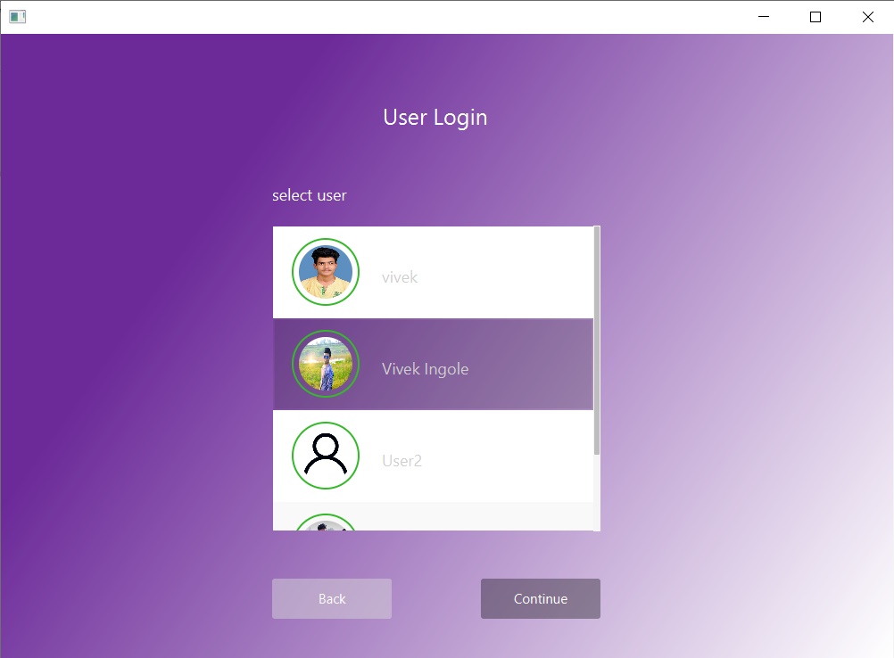
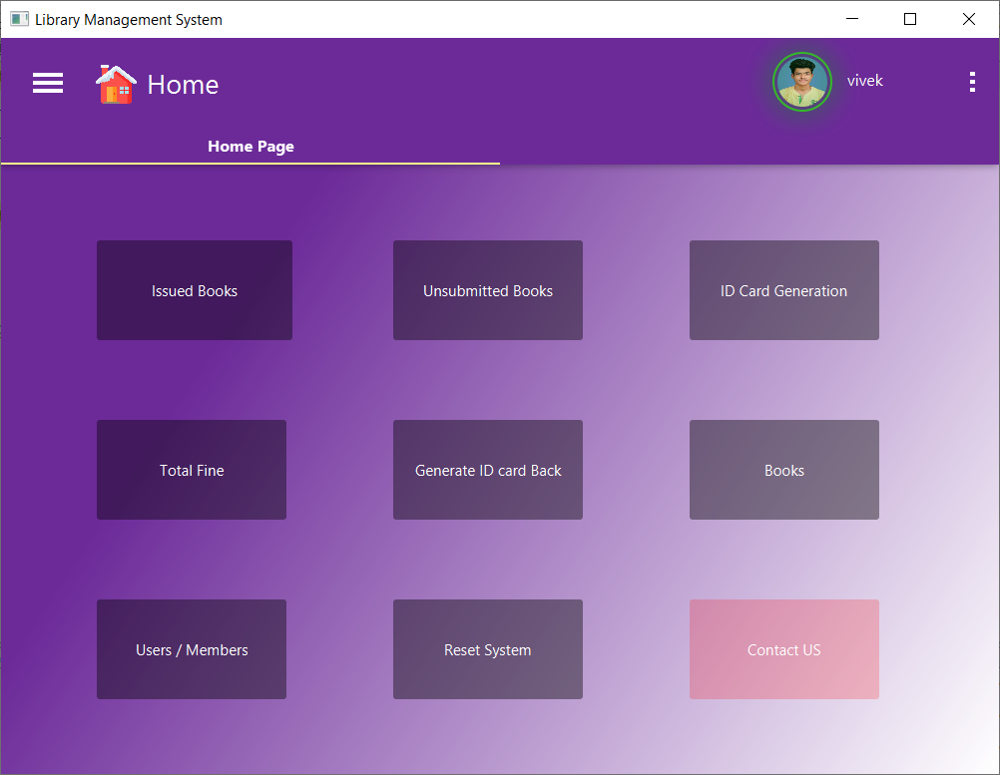

# Library-Management-System

 
## Welcome Screen  

 
## Contact US page  

 
## Available Users for Login  

 
## Login Page

 
## Home Screen

 
## User Profile Sidepane

 
## Menus

 
## Books Management(add/delete/modify)

 
## Edit Book Records

 
## Issue Books

 
## Submit/Renew Books

 
## Import Data from excel

 
## System Users management

 
## System Settings.

 
## Graphical Report.

 
## ID card generated by system.
